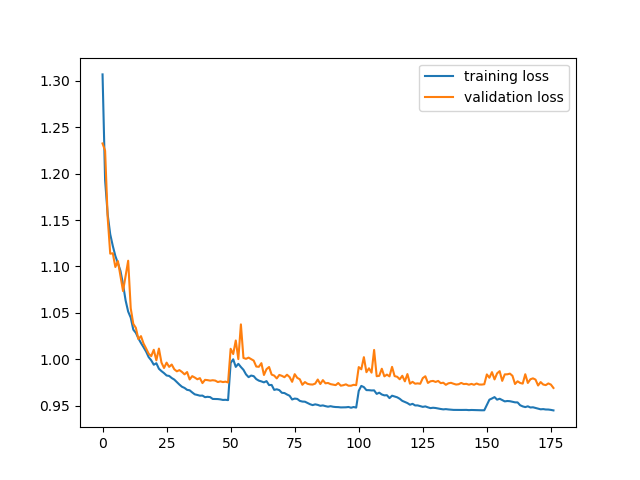
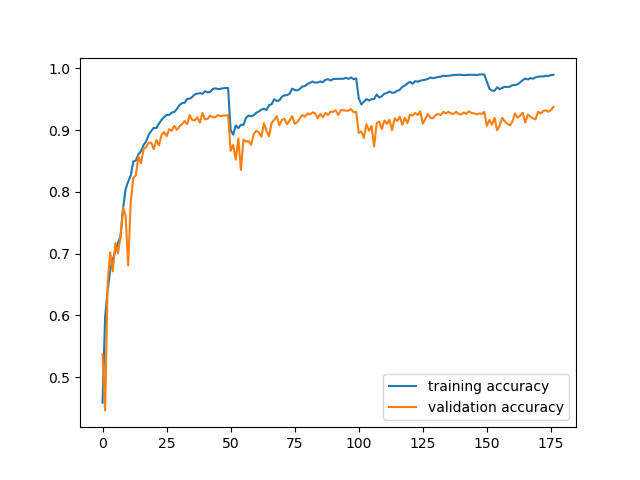
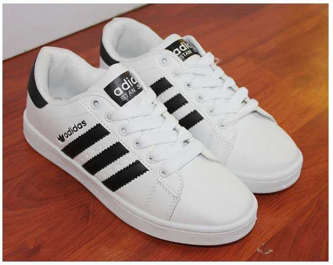

## Project Title

A multi-output classification model for apparel images dataser from https://www.kaggle.com/trolukovich/apparel-images-dataset

### Data
The dataset consist of 11385 images and includes next categories:
```
black_dress: 450
black_pants: 871
black_shirt: 715
black_shoes: 766
black_shorts: 328
blue_dress: 502
blue_pants: 798
blue_shirt: 741
blue_shoes: 523
blue_shorts: 299
brown_pants: 311
brown_shoes: 464
brown_shorts: 40
green_pants: 227
green_shirt: 230
green_shoes: 455
green_shorts: 135
red_dress: 800
red_pants: 308
red_shoes: 610
white_dress: 818
white_pants: 274
white_shoes: 600
white_shorts: 120
```
### Training
```
python train.py
```
Loss during training process



Accuracy during training process



### Testing
Test with image

```
python test.py
```
Result:
```
white_shoes
```